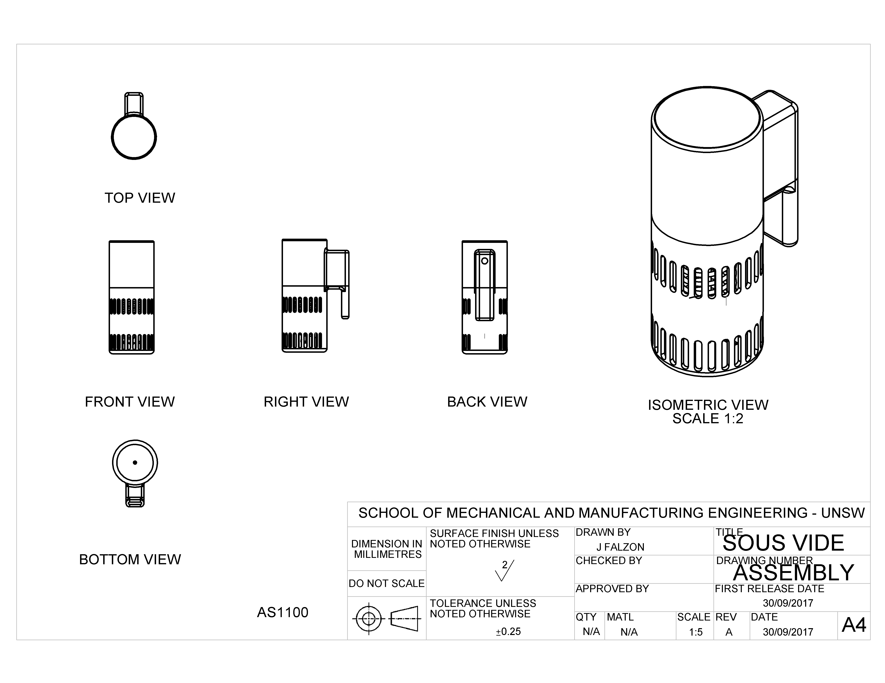
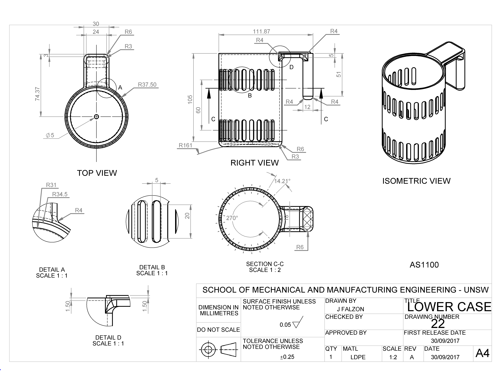
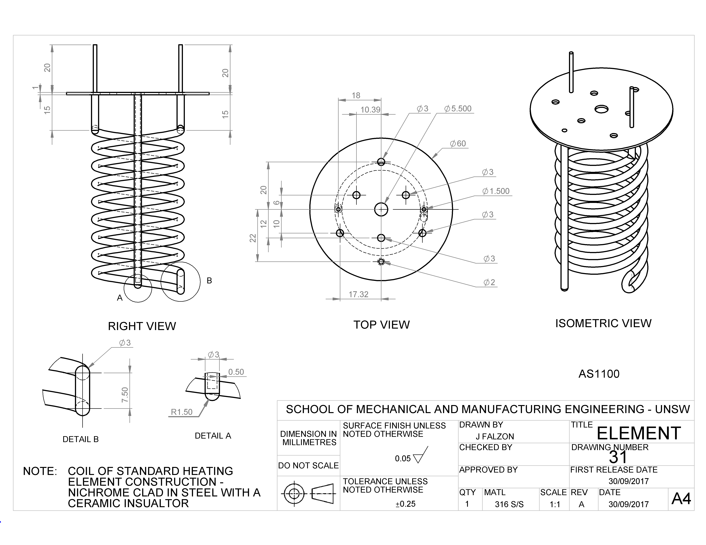
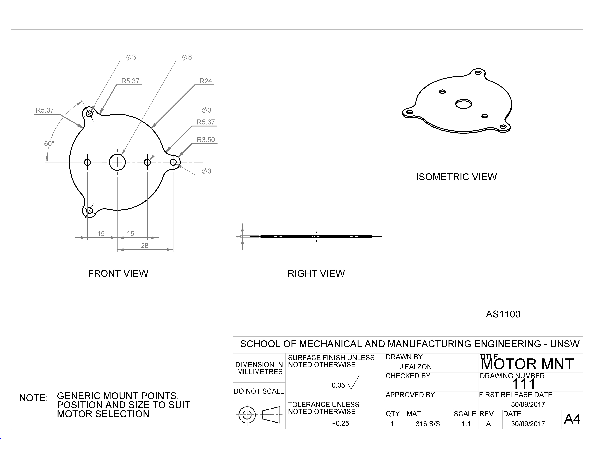
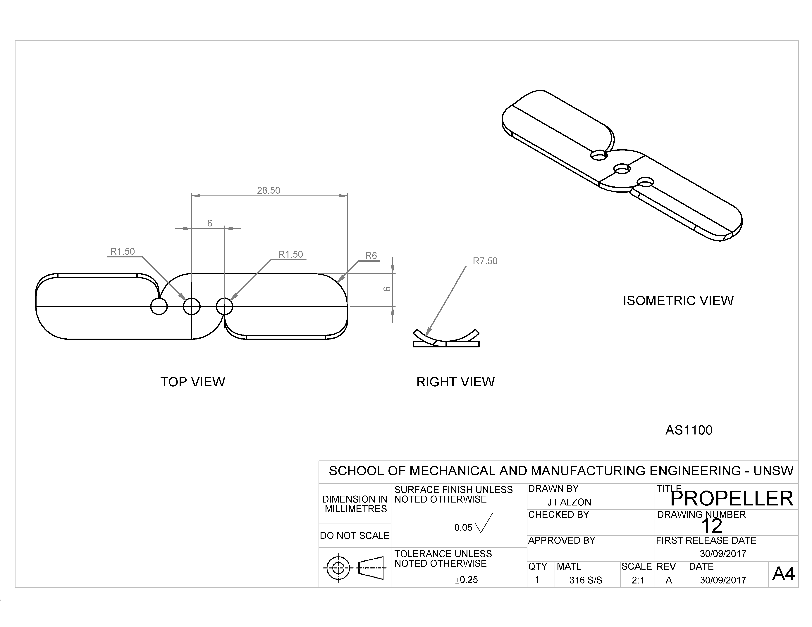
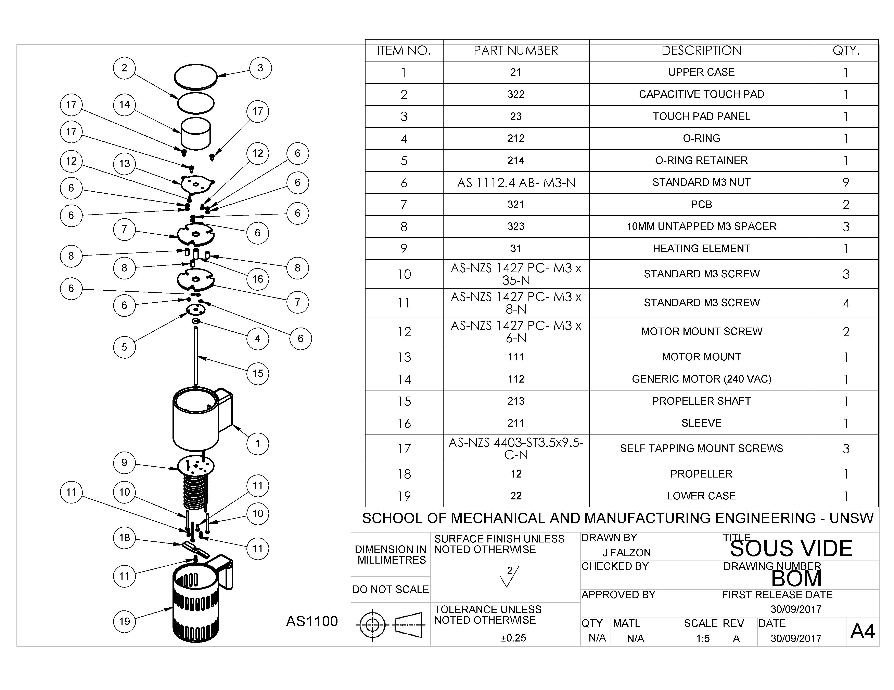

# Sous Vide
## Introduction

The sous vide machine works by heating a water bath to a constant temperature then sealed food is then placed in the water bath until cooked. The aim of this project was to design a kitchen appliance and produce a mock up patent application for the device. The device produced used designed to hang from a cooking pot filled with water, the device would then cycle water past a heating element while maintaining a regulated water bath temperature. While these images are marked to AS1100 specification, (and should largely be in spec) they were designed to the specification provided in the class which, to the best of my knownledge, had been derived from the actual AS1100 specification. These models and drawings were produced using Solidworks. These are produced as design concepts, so do not include manufacturing features such as drafts for cast parts and cutting clearances.

### Assembly

Assembled.

### Case, Lower

Lower case portion. This part was intended to be injection moulded plastic.

Heating element plate. This assembly was intended to be made of two components, an pressed iron top plate and an iron clad nichrome heating element with ceramic insulation material. The two components would then be welded or brazed to fix, producing the subassembly.

Motor mount. A simple mounting plate made from pressed iron to accomodate an axial motor of approximately 50 Watts.

Propeller. A simple pressed iron propeller driven to draw the water into the machine, past the heating element then vented to the cooking vessel.

Exploded view.
